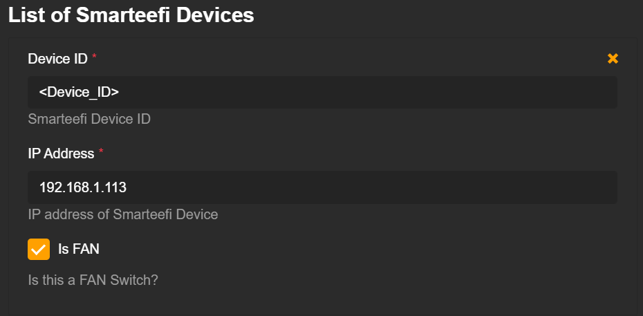
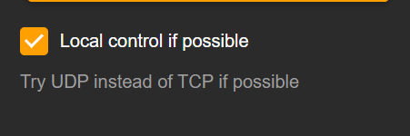

# Homebridge Smarteefi Plugin


[](LICENSE)

<p align="center">
  
</p>

A comprehensive Homebridge plugin to integrate your Smarteefi smart home devices with Apple HomeKit. Control your Smarteefi switches and fans seamlessly through the Home app, Siri, and automation.

## Features

✨ **Full Device Support**

- Smart Switches (Single, Double, Triple, Quadruple configurations)
- Smart Fan Controllers with variable speed control
- Real-time state synchronization

🌐 **Dual Control Modes**

- **Cloud Mode**: Control devices from anywhere via Smarteefi cloud API
- **Local Mode**: Direct LAN control for faster response times (requires local network setup)

🔄 **Smart State Management**

- Automatic periodic state refresh (configurable interval)
- Reliable state synchronization across multiple control points
- Optimized caching for responsive performance

🏠 **HomeKit Integration**

- Full Siri voice control support
- HomeKit automation and scenes
- Multi-room support
- Secure HomeKit architecture

## Installation

### Prerequisites

- [Homebridge](https://homebridge.io/) v1.3.0 or later
- Node.js v14.0.0 or later
- Active Smarteefi account with configured devices

### Install Plugin

```bash
npm install -g homebridge-smarteefi-plugin
```

Or install via the Homebridge UI by searching for `homebridge-smarteefi-plugin`.

## Configuration

### Via Homebridge UI (Recommended)

1. Open Homebridge Config UI X
2. Navigate to **Plugins** tab
3. Search for **Smarteefi Plugin**
4. Click **Settings** to configure

### Manual Configuration

Add the following to your Homebridge `config.json`:

```json
{
  "platforms": [
    {
      "platform": "Smarteefi-Plugin",
      "name": "Smarteefi",
      "userid": "your.email@example.com",
      "password": "your_password",
      "local": false,
      "refreshDelay": 60000,
      "devices": [
        {
          "device": "DEVICE_ID_1",
          "ip": "192.168.1.100",
          "isFan": false
        },
        {
          "device": "DEVICE_ID_2",
          "ip": "192.168.1.101",
          "isFan": true
        }
      ]
    }
  ]
}
```

### Configuration Parameters

| Parameter        | Type    | Required      | Default   | Description                                         |
| ---------------- | ------- | ------------- | --------- | --------------------------------------------------- |
| `platform`     | string  | **Yes** | -         | Must be `"Smarteefi-Plugin"`                      |
| `name`         | string  | **Yes** | -         | Platform name (e.g., "Smarteefi")                   |
| `userid`       | string  | **Yes** | -         | Your Smarteefi account email                        |
| `password`     | string  | **Yes** | -         | Your Smarteefi account password                     |
| `local`        | boolean | No            | `false` | Enable local LAN control                            |
| `refreshDelay` | number  | No            | `60000` | State refresh interval in milliseconds (min: 10000) |
| `devices`      | array   | **Yes** | -         | Array of device configurations                      |

#### Device Configuration

| Parameter  | Type    | Required      | Description                                                             |
| ---------- | ------- | ------------- | ----------------------------------------------------------------------- |
| `device` | string  | **Yes** | Device ID from Smarteefi app                                            |
| `ip`     | string  | Conditional   | Device IP address (required for local mode, recommended for cloud mode) |
| `isFan`  | boolean | No            | Set to `true` for fan controllers, `false` for switches             |

### Finding Device Information

#### Device ID

1. Open the Smarteefi mobile app
2. Navigate to your device
3. Tap on device settings/info
4. Copy the Device ID (usually starts with "nf" or "sf")

#### IP Address

1. Check your router's DHCP client list
2. Or use the Smarteefi app to find the device's network information
3. **Recommended**: Set up a static IP or DHCP reservation in your router



### Local Control Setup

For faster response times, enable local LAN control:

1. Set `"local": true` in configuration
2. Ensure all devices have valid IP addresses configured
3. Configure LAN access in Smarteefi app (if required)



**Note**: Local control requires devices and Homebridge server to be on the same network.

## Supported Devices

### Smart Switches

- ✅ Single-gang switches
- ✅ Double-gang switches
- ✅ Triple-gang switches
- ✅ Quadruple-gang switches
- ✅ ON/OFF control per switch
- ✅ State synchronization

### Smart Fans

- ✅ ON/OFF control
- ✅ Variable speed control (4 speeds: 25%, 50%, 75%, 100%)
- ✅ Speed state persistence
- ✅ Automatic state synchronization

## Usage

### Control via Home App

1. **Switches**: Tap to toggle ON/OFF
2. **Fans**:
   - Tap power icon to toggle ON/OFF
   - Use slider to adjust speed
   - Long press for additional options

### Siri Voice Control

```
"Hey Siri, turn on the bedroom fan"
"Hey Siri, set the living room fan to 75%"
"Hey Siri, turn off all lights"
```

### Automation Examples

**Morning Routine**

- Turn on specific switches at sunrise
- Set fan to preferred speed

**Good Night Scene**

- Turn off all switches
- Turn off all fans
- Activate night lighting

## Troubleshooting

### Devices Not Appearing in HomeKit

1. Verify credentials in configuration
2. Check that devices are configured in `devices` array
3. Restart Homebridge
4. Check Homebridge logs for errors

### State Not Updating

1. Verify `refreshDelay` is set (minimum 10000ms / 10 seconds)
2. Check network connectivity
3. For local mode, ensure devices are reachable on LAN
4. Check Homebridge logs for API errors

### Local Control Not Working

1. Verify `"local": true` in configuration
2. Ensure IP addresses are correct
3. Confirm devices and Homebridge are on same network
4. Check firewall settings (UDP port 10201)

### Fan Speed Issues

1. Ensure `"isFan": true` is set for fan devices
2. Restart Homebridge after configuration changes
3. Check logs for state synchronization messages

### View Logs

```bash
# Homebridge logs location (default)
~/.homebridge/homebridge.log

# Or view in real-time
tail -f ~/.homebridge/homebridge.log
```

## Technical Details

### Architecture

The plugin uses a dual-layer approach:

- **Cloud API**: Smarteefi REST API v3 for remote control and device discovery
- **Local Control**: UDP packets on port 10201 for LAN-based control

### State Management

- Centralized state cache using `DeviceStatus` singleton
- Periodic background refresh from API
- Optimistic updates for immediate UI feedback
- Conflict resolution prioritizing local cache

### Security

- Credentials stored in Homebridge configuration (ensure file permissions are restricted)
- Local control uses direct UDP without authentication (local network only)
- Cloud control uses secure HTTPS with access tokens

## Reverse Engineering

Smarteefi uses UDP packets to communicate with devices on the local network. The protocol involves:

- **Command Structure**: Hex-encoded messages with device ID, switch map, and status map
- **Port**: UDP 10201
- **Response**: Devices respond with status confirmation

If you're interested in understanding the protocol:

1. Install [Wireshark](https://www.wireshark.org/)
2. Filter for UDP traffic on port 10201
3. Analyze packet structure in `SmarteefiLocalAPIHelper.ts`

The Smarteefi cloud API is a standard REST API using JSON payloads. Device states are maintained server-side and synchronized periodically.

## Development

### Building from Source

```bash
# Clone repository
git clone https://github.com/yourusername/homebridge-smarteefi-plugin.git
cd homebridge-smarteefi-plugin

# Install dependencies
npm install

# Build TypeScript
npm run build

# Run in development mode
npm run watch
```

### Project Structure

```
src/
├── index.ts                    # Plugin entry point
├── platform.ts                 # Main platform logic
├── constants.ts                # Constants and configurations
└── lib/
    ├── accessories/
    │   ├── BaseAccessory.ts    # Base accessory class
    │   ├── SwitchAccessory.ts  # Switch implementation
    │   └── FanAccessory.ts     # Fan implementation
    ├── Config.ts               # Configuration models
    ├── SmarteefiAPIHelper.ts   # Cloud API client
    ├── SmarteefiLocalAPIHelper.ts  # Local UDP client
    └── SmarteefiHelper.ts      # Utility functions
```

## Contributing

Contributions are welcome! Please feel free to submit a Pull Request.

### Guidelines

1. Fork the repository
2. Create a feature branch (`git checkout -b feature/amazing-feature`)
3. Commit your changes (`git commit -m 'Add some amazing feature'`)
4. Push to the branch (`git push origin feature/amazing-feature`)
5. Open a Pull Request

## License

This project is licensed under the MIT License - see the [LICENSE](LICENSE) file for details.

## Disclaimer

This is an unofficial plugin and is not affiliated with or endorsed by Smarteefi. Use at your own risk.

## Support

- 🐛 **Bug Reports**: [GitHub Issues](https://github.com/yourusername/homebridge-smarteefi-plugin/issues)
- 💡 **Feature Requests**: [GitHub Issues](https://github.com/yourusername/homebridge-smarteefi-plugin/issues)
- 📖 **Documentation**: This README and inline code comments
